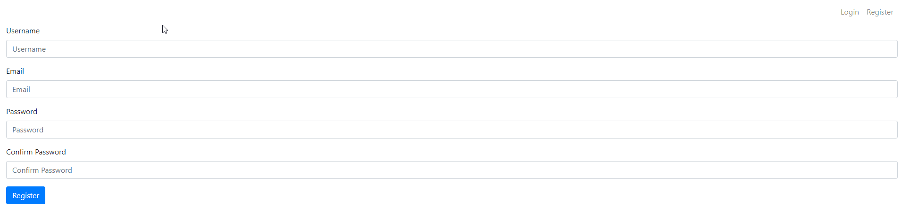

# RegLog System
 Register/Login system for websites
 
 # Info
 Forms created with Bootstrap 4 for better looks. Working on simple PHP & MySQL system. Passwords are hashed. With email verification.
 
 # How to use
 1) Change the connection details in script/conn.php
 2) Enjoy!
 
 *You have to setup email server, in xampp it is sendmail. On webhosting of mine works fine. If you don't have one, google works just fine.
 
 # What I Learned
 - MySQL basics (phpMyAdmin)
 - PHP basics
 - Sessions
 - Cookies
 - Email server
 

              

